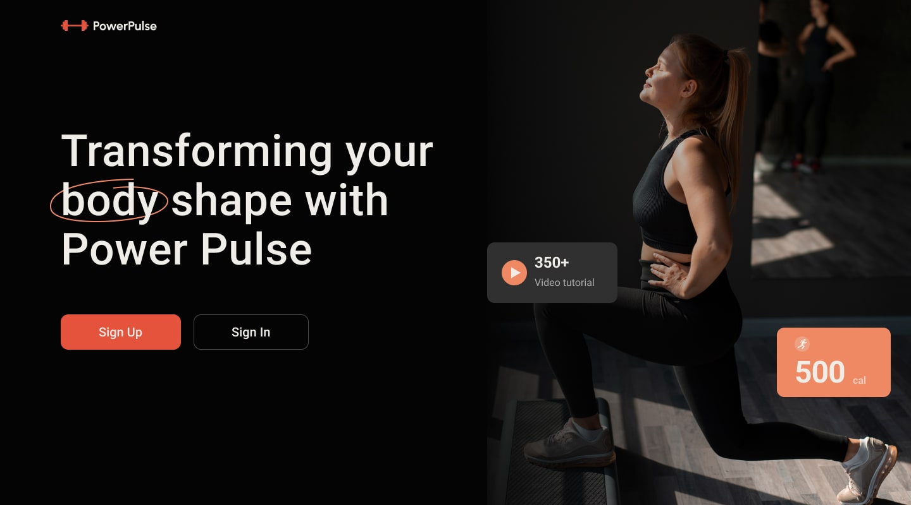
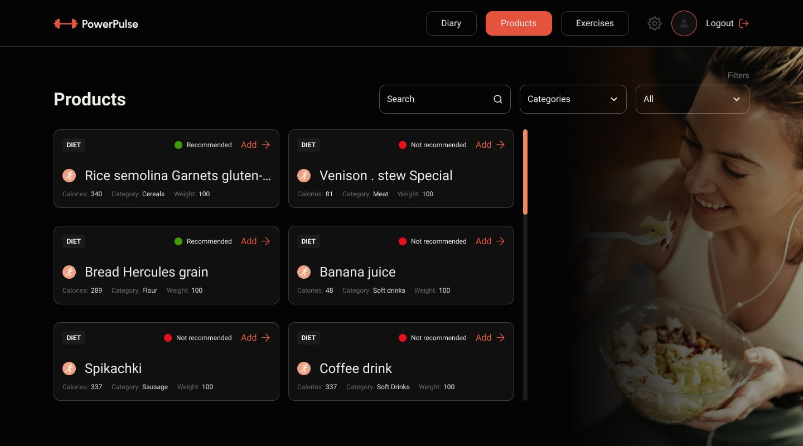
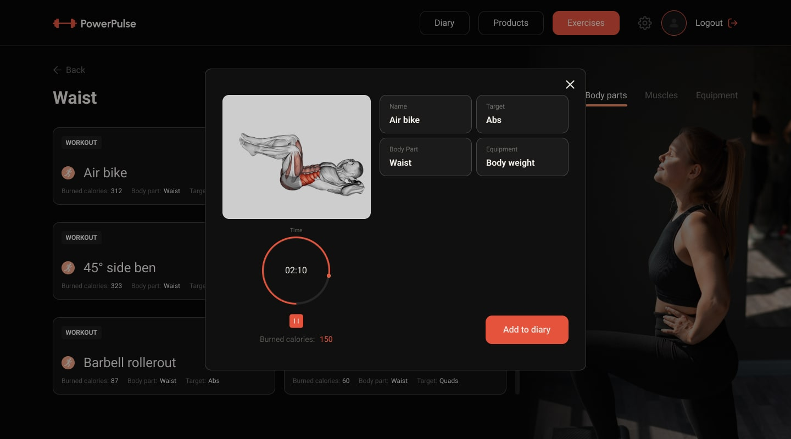

# Трансформуй своє тіло з `Power Pulse`

## Підбери продукти

## Обери вправи

Цей проєкт було створено за допомогою [Create Vite](https://vitejs.dev/).

1. Встановіть базові залежності проекту командою `npm install`.
2. Запустіть режим розробки, виконавши команду `npm run dev`.

## Backend знаходиться [тут](https://github.com/ectionboy/power-pulse-6-backend)
